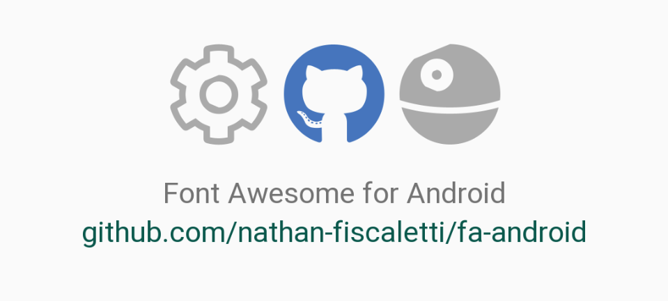
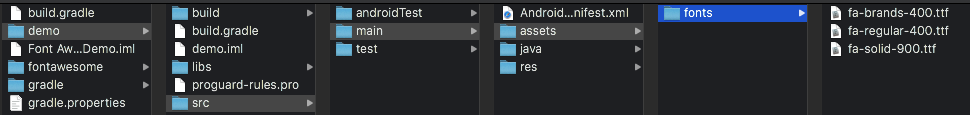
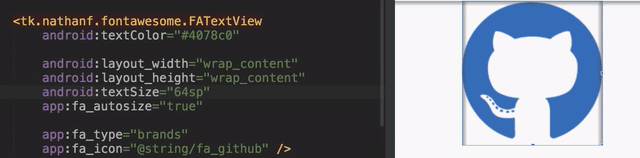

# Font Awesome for Android

An implementation of Font Awesome for Android Projects.

Learn more about Font Awesome [here](https://fontawsome.com)

[](https://jitpack.io/#nathan-fiscaletti/fa-android)
[](https://jitpack.io/#nathan-fiscaletti/fa-android)
[](https://github.com/nathan-fiscaletti/fa-android/blob/master/LICENSE)



## Install Font Awesome for Android into your Android application

1. In your **project level** `build.gradle` add the repository

    ```gradle
    allprojects {
        repositories {
            ...
            maven { url 'https://jitpack.io' }
        }
    }
    ```
    
2. In your **module level** `build.gradle` add the library (find the version numbers [here](https://github.com/nathan-fiscaletti/fa-android/releases))

    ```gradle
    dependencies {
        ...
        implementation 'com.github.nathan-fiscaletti:fa-android:LATEST_VERSION'
    }
    ```
    
After installing the library, in your target (not in the fontawesome target), you will need to create a directory for the font assets.

1. Create a directory in `your_app/src/main` called `assets`.
2. Within the `assets` directory create a directory called `fonts`.
3. Download your web fonts from font awesome and move either your free or pro font awesome font files into the assets directory, this project supports both. You should specifically move the `.ttf` font files. For Font Awesome 5.12.0 they are stored within the `webfonts` directory of the zip file you download.

The final directory structure should look like this:



## General Usage

### Adding a FATextView in your XML Layout

```xml
    <tk.nathanf.fontawesome.FATextView
        android:layout_width="wrap_content"
        android:layout_height="wrap_content"

        app:fa_type="solid"
        app:fa_icon="@string/fa_cloud_drizzle"

        android:textColor="@android:color/black"
        android:textSize="150sp"

        app:layout_constraintBottom_toBottomOf="parent"
        app:layout_constraintLeft_toLeftOf="parent"
        app:layout_constraintRight_toRightOf="parent"
        app:layout_constraintTop_toTopOf="parent" />
```

### Create an FATextView in Java

```java
FATextView faTextView = new FATextView(context);
```

**OR**

```java
FATextView faTextView = new FATextView(context, R.string.fa_check_circle, FATypeface.FAType.Solid, true);
```

> The parameters are in the following order: The Context, the Icon, The Icon Type, true for autosize. If you set autosize to false when initializing it, you can later opt to autosize it using `faTextView.autoSizeIcon();`.

### Controlling the Icon

To change the icon set `fa_icon` to `@string/fa_...` where `...` is the name of the icon you would like to use. You can also control the type of icon used using the `fa_type` property with one of the following: `solid`, `light`, `regular`, or `brands`.

Alternately, if you are working in code, you can use the following functions:

```java
faTextView.setIcon(R.string.fa_check_circle);
faTextView.setTypeface(FATypeface.FAType.Solid);
```

> You can control the icon color using `android:textColor`.

### Controlling the Icon Size



There are two ways to control the size of the icon. 

* Use `wrap_content` for both the **width** and **height** of your view, and control the icon size using `android:textSize="XXsp".
* Do not use `android:textSize` at all, and instead explicitly set **width** and **height**.

When using `wrap_content`, the icon will follow the `android:textSize` property for sizing.
When using explicate sizes, the icon will automatically scale to the size of the view. 

> You can opt to turn off auto-sizing using `app:fa_autosize="false"`.
